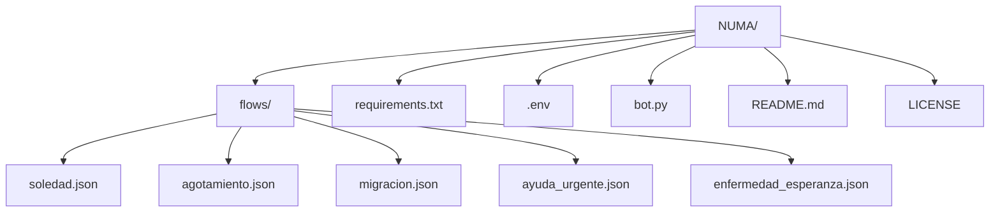

  

  
  
  
  

# NUMA – Chatbot de ayuda emocional con propósito humano 🤖💙  
*(Proyecto en desarrollo activo | Desarrollado por Mariela Rajoy)*  

## 🧭 Descripción (ES)  
NUMA es un chatbot de acompañamiento emocional creado para ofrecer contención y orientación a personas vulnerables.  
Está desarrollado en Python, usa flujos conversacionales en JSON y se conecta vía Telegram.

NUMA no reemplaza ayuda profesional, pero es un primer paso cálido y empático. Aborda situaciones como:  
- Soledad  
- Agotamiento  
- Migración  
- Ayuda urgente  
- Enfermedad y esperanza  

Cada conversación está diseñada con sensibilidad, accesibilidad y seguimiento posterior para no dejar sola a la persona.

---

## 🌍 Description (EN)  
NUMA is an emotional support chatbot built to offer empathy, orientation, and a safe first step for vulnerable individuals.  
Developed in Python, it uses structured JSON flows and connects through Telegram.

NUMA doesn’t replace professional help but offers a warm, human-centered starting point. Topics include:  
- Loneliness  
- Burnout  
- Migration  
- Urgent help  
- Illness and hope  

The bot includes follow-up mechanisms to ensure continuous support after the first contact.

---

## 🛠️ Tecnologías utilizadas / Technologies used  
- Python  
- JSON (flow structure)  
- Telegram Bot API  
- Make (workflow automation)  
- GitHub (open documentation)  

---

## 📦 Estructura del Proyecto / Project Structure

*Nota: el archivo .env no se incluye en el repositorio.*

---

## 🔮 Futuro del proyecto / Project roadmap

### 🇪🇸 Español

**NUMA** es un proyecto en constante evolución. Estas son las próximas etapas previstas:

- 🤖 **Integración con Botpress**: contemplamos el uso de **Botpress** como plataforma avanzada para escalar y gestionar conversaciones más complejas, sin perder el enfoque humano.  
- 📱 **WhatsApp y Facebook Messenger**: planeamos conectarlo a estos canales para ampliar el alcance, especialmente en situaciones de emergencia o conectividad limitada.  
- 🚨 **Nuevo flujo – Incidentes en la vía pública**: ofrecerá apoyo emocional y orientación en situaciones como accidentes, violencia o emergencias callejeras.  
- 🧠 **Procesamiento de lenguaje natural (NLP)**: se incluirá para interpretar mejor los mensajes y dar respuestas más humanas e intuitivas.  
- 🌐 **Acceso vía web (WordPress o similar)**: se desarrollará una versión web para facilitar el acceso sin depender de Telegram.  

---

### 🇬🇧 English

**NUMA** is a continuously evolving project. Here’s what’s coming next:

- 🤖 **Botpress integration**: we plan to use **Botpress** for more advanced flow management without losing the human-centered approach.  
- 📱 **WhatsApp & Facebook Messenger integration**: planned to increase reach, especially in emergencies or low-connectivity contexts.  
- 🚨 **New flow – Public Incidents**: to support people during street emergencies, violence or accidents, providing emotional and practical guidance.  
- 🧠 **Natural Language Processing (NLP)**: to improve understanding and make interactions more natural.  
- 🌐 **Web version (WordPress or similar)**: to make NUMA accessible beyond Telegram via a public website.

---

♿ **Accesibilidad y usabilidad universal**: NUMA está siendo diseñado con enfoque en accesibilidad digital. Queremos asegurar que sea usable por personas con discapacidades visuales u otras condiciones, mediante compatibilidad con lectores de pantalla, navegación clara y flujos comprensibles sin necesidad de clasificaciones forzadas.

♿ **Accessibility and inclusive design**: NUMA is being developed with a focus on digital accessibility. We aim to ensure usability for people with visual impairments or other conditions, by supporting screen readers, offering clear navigation, and designing flows that do not require forced classifications.
