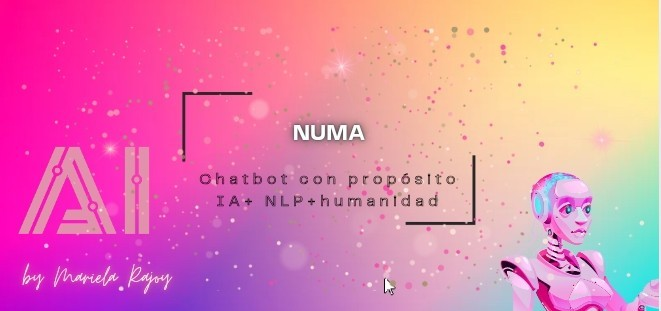

<p align="center">
  
</p>


# Numa — Chatbot con Propósito

**Numa** es un proyecto personal de inteligencia artificial desarrollado por Mariela Rajoy. Su propósito es explorar cómo el procesamiento del lenguaje natural (NLP) y las herramientas de automatización pueden brindar apoyo real en contextos sensibles como salud mental, acompañamiento emocional y situaciones de vulnerabilidad.

---

## 🚀 Cómo usar este proyecto

1. Cloná el repositorio:
   ```bash
   git clone https://github.com/mariegratia/numa-chatbot.git
   cd numa-chatbot
   ```

2. Ejecutá localmente:
   ```bash
   python src/numa_handler.py
   ```

3. Explorá el flujo:
   - Ver el archivo [`estructura-flujo.json`](estructura-flujo.json)

---

## 📌 Estado del Proyecto

- [x] Identidad y nombre definidos  
- [x] Lógica básica en Python (`numa_handler.py`)  
- [x] Estructura de flujos en JSON (`estructura-flujo.json`)  
- [ ] Integración con APIs (GPT-4o en progreso)  
- [ ] Conexión con Power Automate / Make  
- [ ] Documentación técnica extendida  

---

## 🛠 Tecnologías utilizadas

- Python
- JSON para flujos conversacionales
- Make / Power Automate (planificado)
- GPT-4o (OpenAI, planificado)

---

## 📄 Licencia

Este proyecto está licenciado bajo los términos de la licencia MIT. Ver el archivo [LICENSE](LICENSE) para más información.

---

## ✨ Créditos

Creado por **Mariela Rajoy** — Ingeniera de Datos y aprendiz de IA con propósito humano.
